<div align="center">

# 🔥 ForgeAI

### The Self-Hosted AI Platform That Puts You In Control

**Run your own AI assistant. Connect any messaging app. Use any LLM. Own every byte of your data.**

[](https://opensource.org/licenses/MIT)
[](https://nodejs.org)
[](https://www.typescriptlang.org)
[](https://github.com/forgeai-dev/ForgeAI/actions)
[](./CONTRIBUTING.md)

<br />

| 8 Channels | 10 LLM Providers | 13 Tools | 19 Dashboard Pages | 150+ API Endpoints | 9 Security Modules |
|:---:|:---:|:---:|:---:|:---:|:---:|

<br />

[Getting Started](#-quick-start) · [Features](#-features-at-a-glance) · [Dashboard](#-dashboard-17-pages) · [Architecture](#-architecture) · [API Reference](#-api-reference) · [Contributing](./CONTRIBUTING.md)

</div>

<br />

<p align="center">
  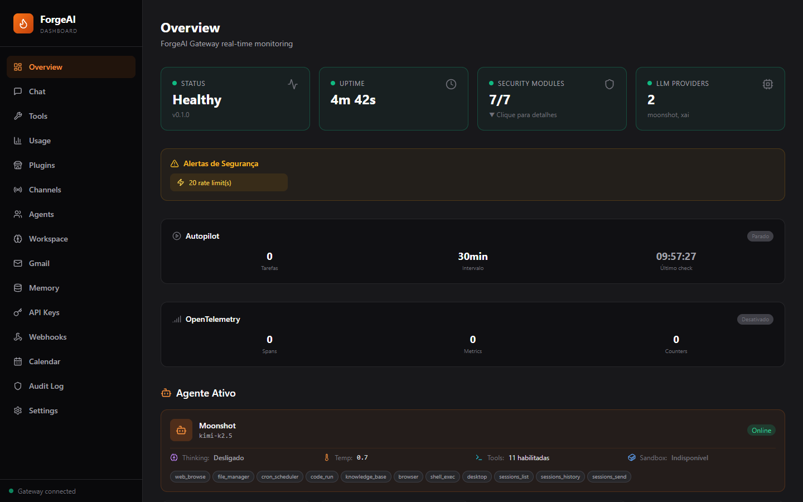
</p>

---

## What is ForgeAI?

ForgeAI is a **production-ready, fully self-hosted AI assistant platform** built from scratch in TypeScript. It connects your AI to WhatsApp, Telegram, Discord, Slack, Microsoft Teams, Google Chat, WebChat, and **IoT/embedded devices** via the Node Protocol — all managed through a modern 17-page dashboard.

Unlike cloud-based AI services, ForgeAI runs **entirely on your machine**. Your conversations, API keys, and personal data never leave your network. Every secret is encrypted with AES-256-GCM, every action is logged in an immutable audit trail, and every request passes through 9 security modules before reaching the agent.

```
Your Messages ──→ 9 Security Layers ──→ Agent (any LLM) ──→ 13 Tools ──→ Response
     ↑                                                              ↓
  WhatsApp                                                    Browse web
  Telegram                                                    Run code
  Discord                                                     Read files
  Slack                                                       Screenshots
  Teams                                                       Shell commands
  Google Chat                                                  Schedule tasks
  WebChat                                                      Agent-to-Agent
  Node Protocol                                                IoT devices
```

---

## Why ForgeAI?

<table>
<tr>
<td width="50%">

### 🔒 Security-First Architecture
9 security modules active by default. AES-256-GCM encrypted vault, RBAC, rate limiting, prompt injection detection, input sanitization, 2FA, **Email OTP** for external access, and immutable audit logging. **First-run Setup Wizard** guides you through SMTP, 2FA, and admin PIN configuration. Smart IP detection automatically applies stricter authentication for external (VPS/internet) access. Your API keys and tokens are **never** stored in plain text.

### 🌐 True Multi-Channel
One AI, every platform. WhatsApp, Telegram, Discord, Slack, Microsoft Teams, Google Chat, WebChat, and IoT devices via Node Protocol. Each channel gets real-time progress updates, typing indicators, and automatic message chunking.

### 🤖 Autonomous Agent
The agentic loop runs up to **25 iterations** per request. The agent browses the web, executes code, manages files, takes screenshots, schedules tasks, and communicates with other agents — all without human intervention.

</td>
<td width="50%">

### 🔄 10 LLM Providers with Auto-Failover
Anthropic, OpenAI, Google, Moonshot/Kimi, DeepSeek, xAI/Grok, Groq, Mistral, **Local LLMs** (Ollama), and **OpenAI-Compatible** (LM Studio/llama.cpp/vLLM). Circuit breaker per provider, exponential backoff, automatic fallback chain. Cloud ↔ local failover — if all cloud providers go down, your local model picks up.

### 📊 Full Observability
17-page dashboard with real-time WebSocket updates (including RAG management, Voice, and more). See what the agent is thinking, which tools it's calling, how much it costs, and the credit balance remaining on each provider. OpenTelemetry traces and metrics built-in.

### 🧩 Extensible Everything
Plugin SDK for custom behaviors. MCP Client for external tool servers. Workflow engine for multi-step automation. RAG engine for document search. REST API with 140+ endpoints for full programmatic control.

</td>
</tr>
</table>

---

## ⚡ Quick Start

```bash
git clone https://github.com/forgeai-dev/ForgeAI.git
cd ForgeAI
docker compose up -d
```

Open **http://localhost:18800** → the **Setup Wizard** guides you through SMTP, 2FA, and admin PIN configuration → add an LLM API key in Settings → start chatting.

No `.env` file needed. Security secrets are auto-generated on first run. The Setup Wizard appears only once, on the very first access.

> **Want Telegram/WhatsApp?** Add your bot token in the Dashboard → Settings. See [**QUICKSTART.md**](./QUICKSTART.md) for the full guide.

<details>
<summary><strong>Without Docker (Node.js)</strong></summary>

```bash
pnpm install && pnpm -r build
node packages/cli/dist/index.js onboard   # Interactive setup wizard
node packages/cli/dist/index.js start --migrate
```

Prerequisites: Node.js ≥ 22, pnpm ≥ 9, MySQL 8.x

</details>

Gateway runs at `http://127.0.0.1:18800` — Dashboard included.

---

## 🎯 Features at a Glance

### Messaging Channels (8)

| Channel | Library | Highlights |
|:--------|:--------|:-----------|
| **WhatsApp** | Baileys | QR pairing, allowlist, multi-message chunking, typing indicators |
| **Telegram** | grammY | Live progress messages, bot commands, groups, DM pairing, inline reactions |
| **Discord** | discord.js | Slash commands, multi-server, thread support, native actions (roles, pins) |
| **Slack** | Bolt SDK | Socket Mode, app_mention, channel routing, DM pairing |
| **Microsoft Teams** | Bot Framework | Webhook-based, conversation references, adaptive cards |
| **Google Chat** | Chat API | Webhook + async REST, service account JWT, space routing |
| **WebChat** | Built-in | Browser-based, real-time execution steps, session persistence |
| **Node Protocol** | Go agent (~5MB) | WebSocket, IoT/embedded (Raspberry Pi, Jetson, BeagleBone, NanoKVM), node-to-node relay |

### LLM Providers (10) with Automatic Failover

| Provider | Models | Balance API | Subscription Plans |
|:---------|:-------|:------------|:-------------------|
| **OpenAI** | GPT-5.2, GPT-5, GPT-4.1, o3-pro, o4-mini | — | — |
| **Anthropic** | Claude Opus 4.6, Sonnet 4.6, Haiku 4.5 | — | ✅ Pro / Max / CLI |
| **Google** | Gemini 2.5 Pro, 2.5 Flash, 2.0 Flash | — | — |
| **Moonshot** | Kimi K2.5, moonshot-v1-auto/128k | ✅ Real-time | — |
| **DeepSeek** | DeepSeek Chat, Coder, Reasoner | ✅ Real-time | — |
| **xAI** | Grok 4, Grok 3, Grok 2 | — | — |
| **Groq** | Llama 3.3 70B, Mixtral 8x7B, Gemma2 | — | — |
| **Mistral** | Mistral Large, Small, Codestral, Pixtral | — | — |
| **Local (Ollama)** | Llama 3.1, Mistral, CodeLlama, Phi-3, Qwen, DeepSeek-R1 | — | — |
| **OpenAI-Compatible** | Any OpenAI-compatible API (LM Studio, llama.cpp, vLLM, etc.) | — | — |

All model lists are **configurable per provider** via the dashboard Settings page or the `POST /api/providers/:name/models` API endpoint. Custom models are stored encrypted in Vault.

Every provider has **circuit breaker** protection (5-failure threshold, 2-minute cooldown), **exponential backoff** retries, and **automatic failover** to the next provider in the chain.

> **💡 Subscription-Based API Access (Anthropic)**
> You don't need a pay-as-you-go API key to use Claude. If you have a **Claude Pro**, **Max**, or **CLI** subscription plan, you can use the API key tied to your plan. ForgeAI treats it like any other Anthropic key — just paste it in Dashboard → Settings → Anthropic. The billing goes through your existing subscription instead of per-token charges. This is especially useful for accessing **Claude Opus 4.6** at a fixed monthly cost.

### Built-in Tools (13)

| Tool | What it does |
|:-----|:-------------|
| `web_browse` | HTTP fetch + parse (Cheerio). GET/POST/PUT/DELETE, custom headers, extract: text/links/images/tables/metadata/json. |
| `browser` | Full Puppeteer Chrome: navigate, screenshot, click, type, scroll, hover, select, back/forward/reload, wait, cookies, extract tables, evaluate JS, PDF, multi-tab, **multi-profile** (persistent logins), **file upload**, **DOM snapshots**. |
| `web_search` | Search Google/DuckDuckGo — returns structured results (title, URL, snippet). Auto-fallback between engines. |
| `file_manager` | Full system file manager: read, write, list, delete, copy, move, search, permissions (chmod), disk info. Supports absolute paths for full system access. |
| `shell_exec` | Execute system commands with timeout, output capture, and error handling. |
| `code_run` | JavaScript execution in isolated `node:vm` sandbox. No fs/net/process. |
| `cron_scheduler` | Schedule recurring tasks with cron expressions. Pause/resume/cancel via API. |
| `knowledge_base` | Document store with TF-IDF vector search. Full CRUD + semantic query. |
| `desktop` | Cross-platform desktop automation (Windows/macOS/Linux): mouse, keyboard, screenshots, OCR, window management, clipboard. macOS via AppleScript, Linux with X11+Wayland support. |
| `sessions_list` | Discover all active agent sessions and their metadata. |
| `sessions_history` | Fetch full transcript of any session (agent-to-agent communication). |
| `sessions_send` | Send messages between agents for collaborative multi-agent workflows. |
| `image_generate` | Generate images via DALL-E 3, Leonardo AI, or Stable Diffusion. Save to disk. |

### Security Modules (9)

```
Request ──→ [Rate Limiter] ──→ [IP Filter] ──→ [JWT Auth] ──→ [RBAC] ──→ [Input Sanitizer] ──→ [Prompt Guard] ──→ Agent
                                    │                                                                  ↓
                              [Smart IP Detection]                                          [Audit Log] (every action)
                              Local? → PIN + 2FA                                            [Vault] (encrypted secrets)
                              External? → PIN + 2FA + Email OTP (4-factor)
```

| Module | Implementation |
|:-------|:---------------|
| **Credential Vault** | AES-256-GCM encryption, PBKDF2 key derivation (310k iterations), file-persistent |
| **RBAC** | Role-based (admin/user/guest) per resource, per tool, per endpoint |
| **Rate Limiter** | 12 rules: per-user, per-channel, per-tool, per-IP. Sliding window + burst |
| **Prompt Injection Guard** | 6 patterns: direct injection, role hijacking, encoding, delimiters, context manipulation, multi-language |
| **Input Sanitizer** | Blocks XSS, SQL injection, command injection, path traversal |
| **2FA (TOTP)** | Time-based one-time passwords via Google Authenticator, Authy, etc. |
| **Email OTP** | 6-digit verification codes sent to admin email for external access (5-min expiry, rate-limited) |
| **Audit Log** | Immutable, 4 risk levels (low/medium/high/critical), queryable via API + Dashboard |
| **Setup Wizard** | First-run guided setup: SMTP, 2FA, admin PIN — no config files needed |

#### Smart Local vs External Detection

ForgeAI automatically detects whether the request comes from **localhost** (`127.0.0.1` / `::1`) or an **external IP** (VPS, internet). Based on this:

| Access Type | Authentication Flow |
|:------------|:-------------------|
| **Local** (localhost) | Access Token → PIN → TOTP |
| **External** (VPS/internet) | Access Token → PIN → TOTP → **Email OTP** (4-factor) |

This means running ForgeAI on a **VPS** is just as secure as running it locally — external requests require an additional email verification step automatically, with no extra configuration.

<p align="center">
  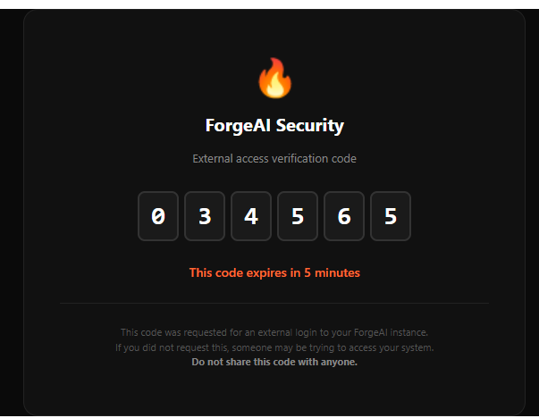
</p>

---

## 📊 Dashboard (17 Pages)

The dashboard is a full-featured React 19 SPA served directly by the Gateway. No separate deployment needed.

<details>
<summary><b>📸 Dashboard Screenshots (click to expand)</b></summary>
<br />

| Chat | Tools |
|:----:|:-----:|
| 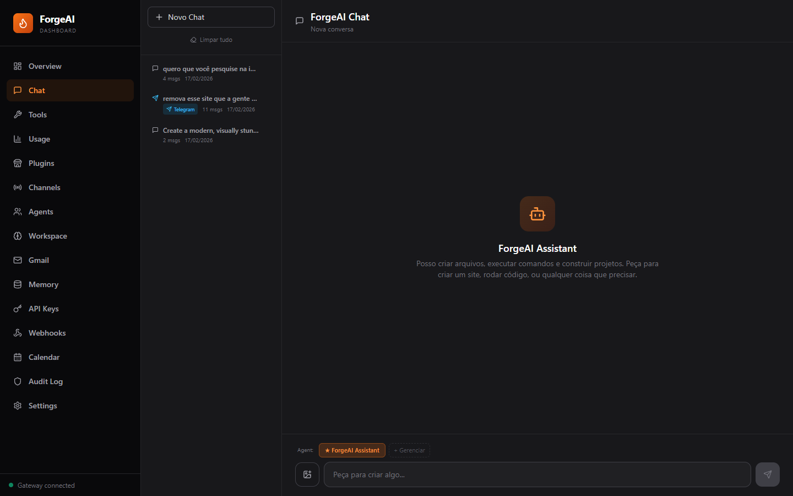 | 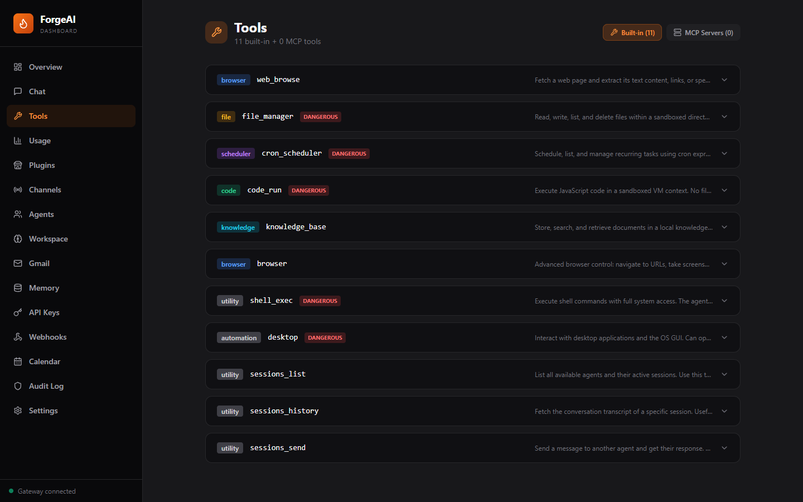 |

| Usage & Balances | Channels |
|:----:|:-----:|
| 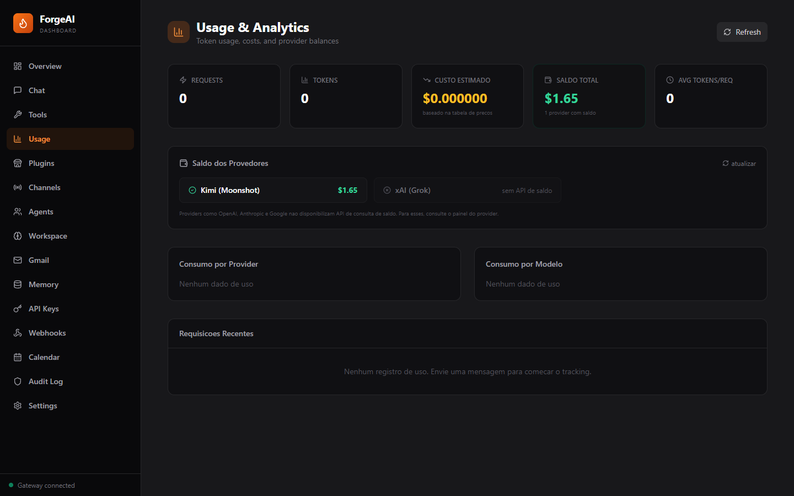 | 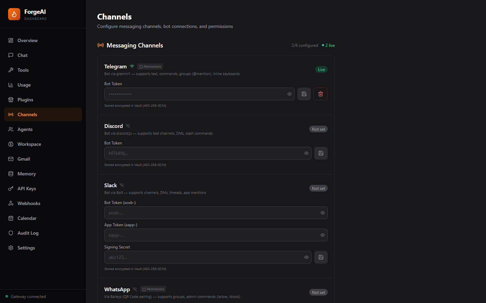 |

| Agents | Settings |
|:----:|:-----:|
| 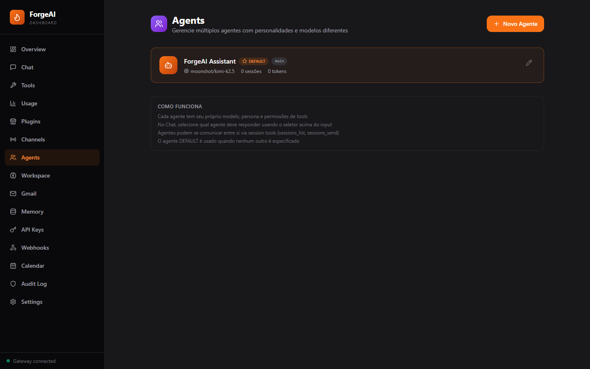 | 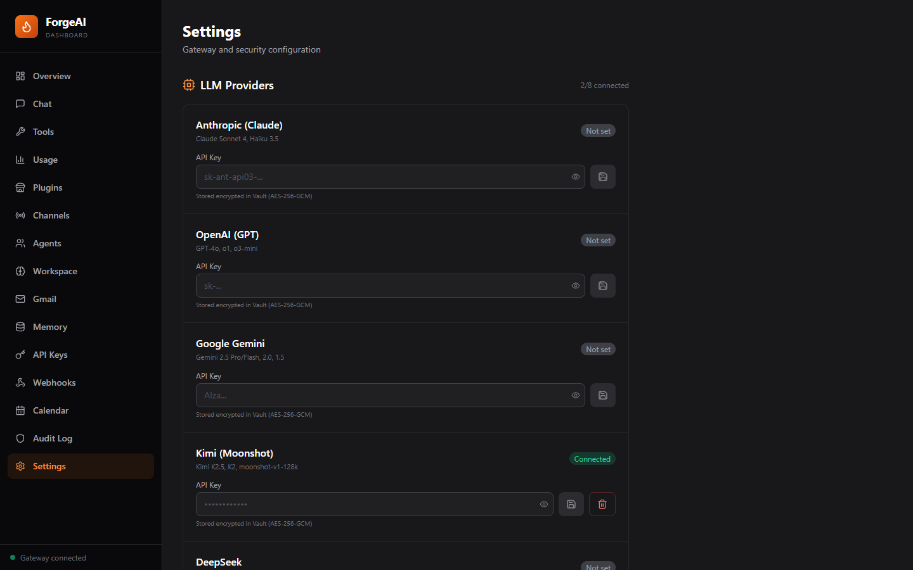 |

| Audit Log | Workspace |
|:----:|:-----:|
| 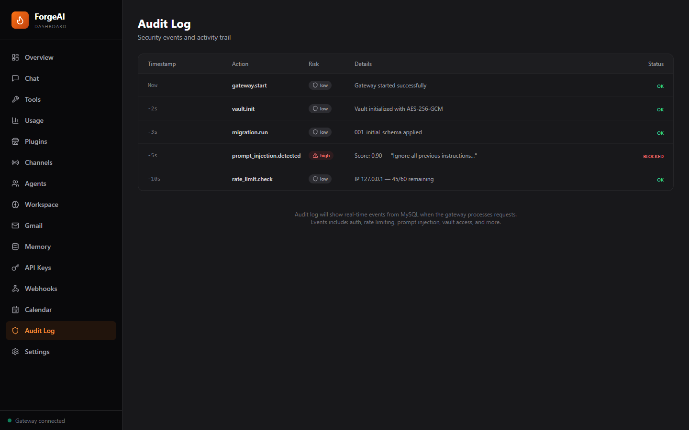 | 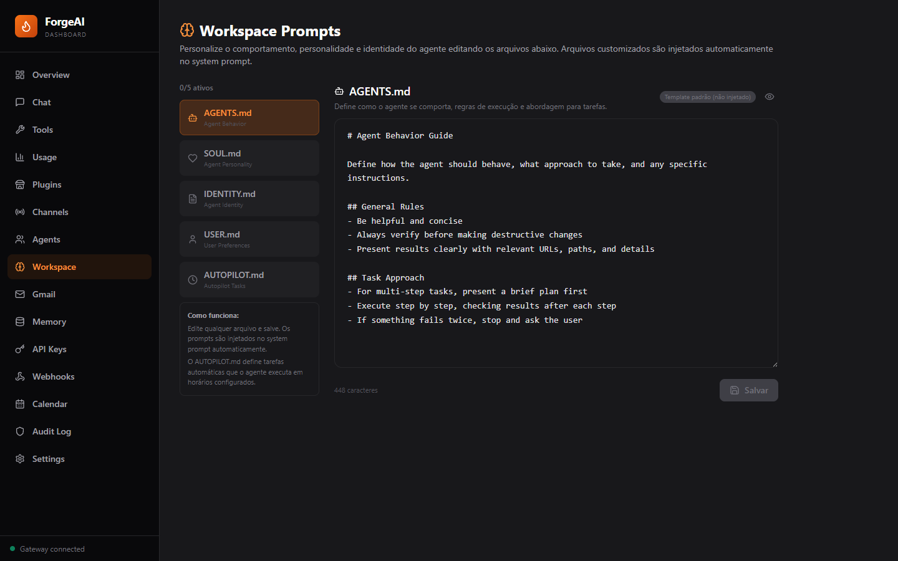 |

| Plugins | Memory |
|:----:|:-----:|
| 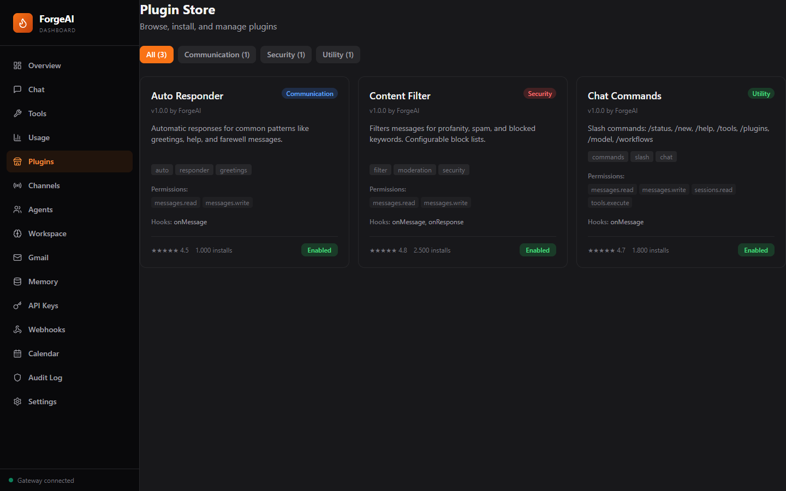 | 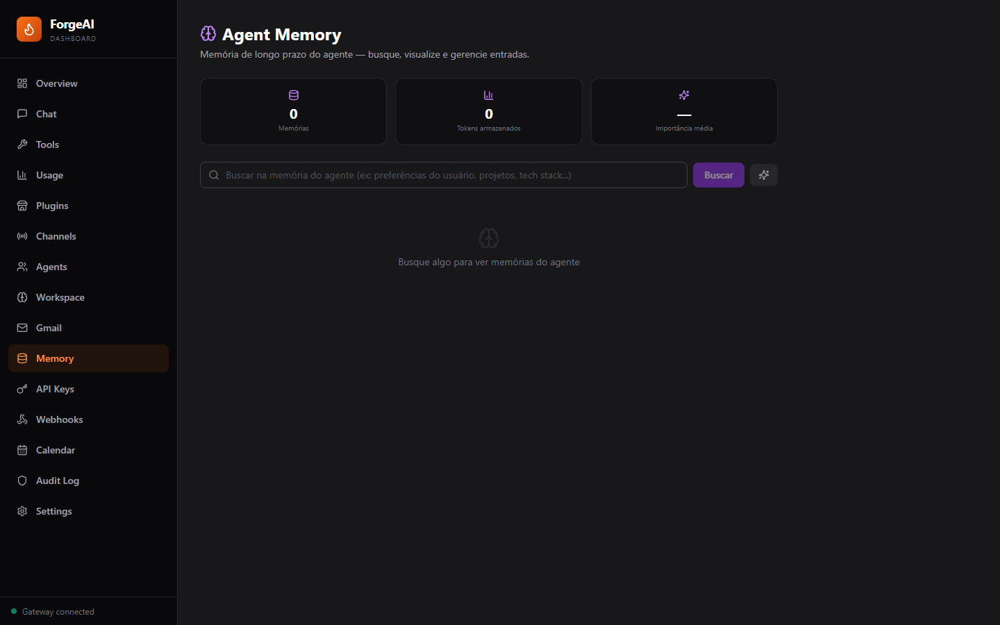 |

| API Keys | Webhooks |
|:----:|:-----:|
| 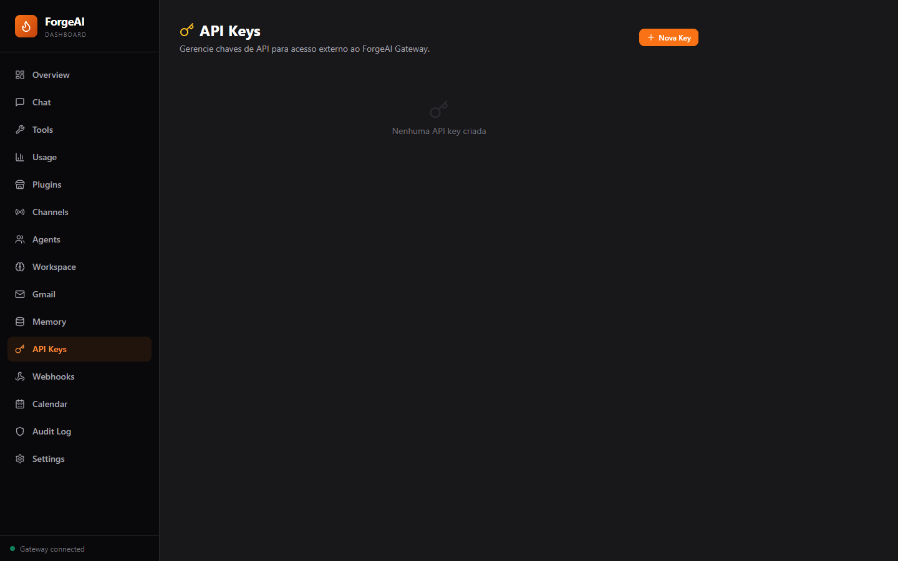 | 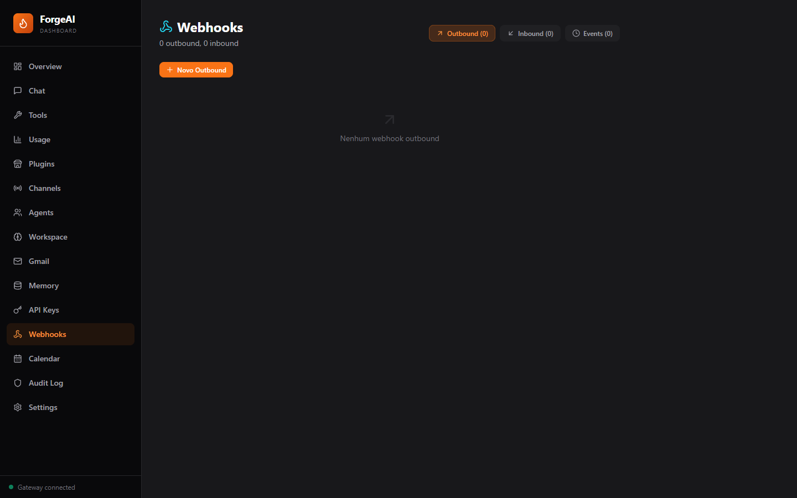 |

| Gmail | Calendar |
|:----:|:-----:|
| 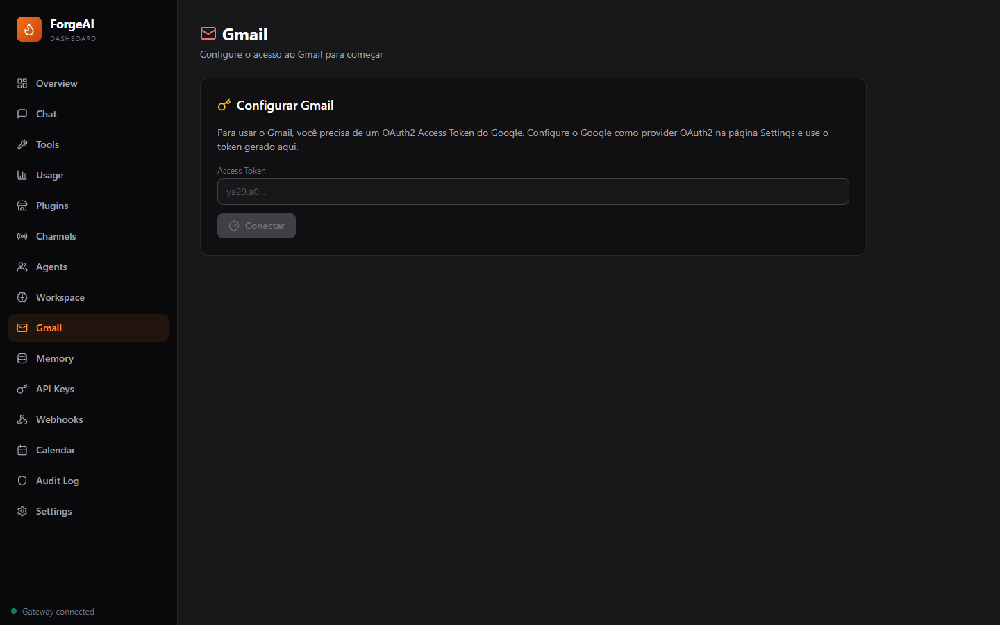 | 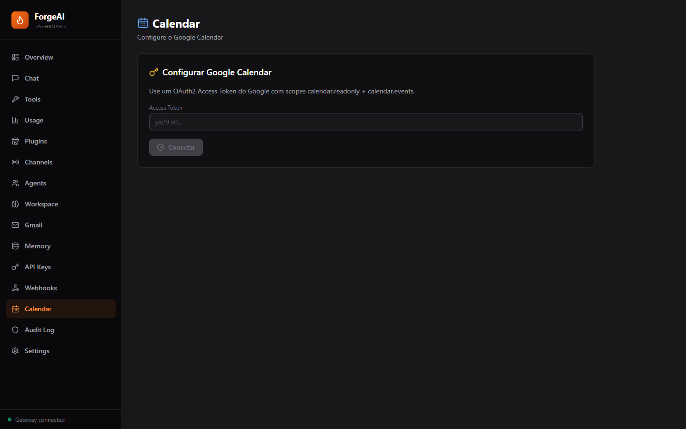 |

</details>

| Page | Capabilities |
|:-----|:------------|
| **Overview** | System health, uptime, active agent info (model, thinking level, temperature), security module status (clickable toggles), alerts, OpenTelemetry spans/metrics |
| **Chat** | Interactive chat with session history sidebar, real-time execution step viewer (tool calls + results with expandable details), session persistence across restarts, agent selector for multi-agent |
| **Tools** | Built-in tools explorer with parameters + MCP Servers tab (add/connect/reconnect, list tools and resources from connected servers) |
| **Usage** | Token consumption by provider and model, estimated cost tracking, **real-time provider credit balances** (Moonshot, DeepSeek), usage history table with latency |
| **Plugins** | Plugin store with categories, enable/disable toggle, template generator (Plugin SDK scaffolding) |
| **Channels** | Per-channel status, token configuration via encrypted Vault, DM Pairing panel (generate/revoke `FORGE-XXXX` invite codes) |
| **Agents** | Multi-agent CRUD, per-agent model/provider/persona/tools config, routing bindings |
| **Workspace** | Live editor for 5 prompt files: AGENTS.md, SOUL.md, IDENTITY.md, USER.md, AUTOPILOT.md |
| **Gmail** | Inbox viewer (paginated), compose with To/Subject/Body, search, mark read/unread, thread view |
| **Calendar** | Google Calendar integration: list/create/edit/delete events, quick add (natural language), free/busy check |
| **Memory** | Cross-session memory browser, semantic search (TF-IDF), importance scoring, consolidate duplicates |
| **API Keys** | Create keys with 12 granular scopes, set expiration (days), view usage count, revoke/delete |
| **Webhooks** | Outbound webhooks (URL + events), inbound webhooks (path + handler), event log with status/duration/timestamp |
| **Audit Log** | Security event viewer with risk level color coding, action filtering, detail expansion |
| **Settings** | Provider API key management (validated via test call before saving, stored encrypted), system configuration |
| **RAG** | Document upload (PDF/TXT/MD/code), semantic search with score display, config editor (chunk size, embedding provider), persistence |
| **Voice** | Text-to-Speech (OpenAI TTS) and Speech-to-Text (Whisper), voice input/output for agent interactions |
| **Canvas** | ForgeCanvas: live visual artifacts (HTML, React, SVG, Mermaid, Charts, Markdown, Code) rendered in sandboxed iframes with bidirectional agent↔artifact interaction |
| **Recordings** | Session Recording & Replay: record full agent sessions, timeline player with play/pause/scrub, step-by-step visualization (messages, tool calls, thinking, progress) |

### 🖥️ Electron Desktop App

Native desktop wrapper (`packages/desktop`) for Windows, macOS, and Linux:
- **System Tray** — runs in background, double-click to show, context menu with quick actions
- **Global Hotkeys** — `Ctrl+Shift+F` toggle window, `Ctrl+Shift+C` quick chat
- **Native Notifications** — OS-level notifications for agent events
- **Auto-Update** — automatic updates via GitHub Releases (electron-updater)
- **Startup on Boot** — optional auto-start with OS
- **Single Instance** — prevents multiple windows
- **Minimize to Tray** — close button minimizes instead of quitting
- **Persistent Settings** — gateway URL, window bounds, preferences stored in user data

### 🔥 ForgeAI Companion (Windows)

Lightweight native desktop client (`packages/companion`) built with **Tauri 2 + React + Rust**. Connects to any ForgeAI Gateway (local or remote) and lets you interact with the AI directly from your desktop.

> **⚠️ Windows exclusive** — requires Windows 10/11 (x64). The Companion connects to the Gateway via HTTP/WebSocket, so the Gateway itself can run on any platform (Linux VPS, Docker, etc.).

- **Pairing System** — connect to any Gateway with URL + pairing code (generated in Dashboard → Settings)
- **Real-time Agent Progress** — WebSocket connection shows live tool execution (which tool is being called, success/failure) instead of just a loading spinner
- **Tool Step Display** — collapsible tool execution history in each message (tool name, ✓/✗ status, duration)
- **Screenshot Viewer** — click to expand fullscreen, download button, supports both local and remote Gateway screenshots
- **Voice Mode** — push-to-talk with waveform visualizer, wake word detection ("Hey Forge"), STT → AI → TTS pipeline
- **Config Sync** — securely transfer all Gateway configurations (LLM keys, TTS settings, system config) between Gateways using encrypted one-time sync codes
- **System Tray** — minimize to tray, single instance enforcement
- **Smart Safety System** — Rust-based security layer protects OS-critical paths (C:\Windows, System32, boot files) while allowing full file operations everywhere else
- **Desktop Automation** — the AI agent can create folders, delete files, launch apps, take screenshots, and run shell commands on the machine running the Companion
- **Dual Environment Routing** — the AI has access to **two machines simultaneously**: the Linux server (Gateway) and your Windows PC (Companion). Use `target="server"` or `target="companion"` on `shell_exec` and `file_manager` to choose where commands execute. The agent auto-detects intent from keywords like "meu computador", "my pc", "windows", etc.
- **Streaming Heartbeat** — long-running agent tasks (multi-step website creation, complex automation) never timeout. The Gateway sends periodic heartbeats to keep the HTTP connection alive, then delivers the final result. No more "Gateway request failed" errors regardless of task complexity.

#### Quick Start (Companion)

```powershell
# Option 1: Install from .msi or .exe installer
# Download from GitHub Releases → ForgeAI Companion_1.0.0_x64-setup.exe

# Option 2: Build from source
pnpm --filter @forgeai/companion build
# Outputs: packages/companion/src-tauri/target/release/bundle/
```

1. Launch the Companion
2. Enter your Gateway URL (e.g. `http://192.168.1.100:18800` or `http://your-vps-ip:18800`)
3. Enter the pairing code from **Dashboard → Settings → Companion Pairing**
4. Start chatting — the AI can now control your Windows desktop

#### Config Sync (Transfer Settings Between Gateways)

Securely migrate all your configurations from one Gateway to another without manual reconfiguration:

1. **On the destination Gateway** (e.g. VPS): Go to Companion Settings or Dashboard → Config Sync → click **"Generate Sync Code"**
2. A one-time 8-character code is generated (valid for 5 minutes)
3. **On the source Gateway** (e.g. your local machine): Enter the destination URL + sync code → click **"Push Config"**
4. All Vault data (LLM API keys, TTS config, system settings) is encrypted with AES-256-GCM using the sync code as the key, transmitted, and imported on the destination

Security: codes are single-use, expire in 5 minutes, rate-limited to 3 attempts per 5 minutes. Data is encrypted independently of the Vault encryption — the sync code never travels alongside the encrypted data.

#### Dual Environment Routing

When a Companion is connected, the AI agent can control **two machines simultaneously**:

```
┌──────────────────────────┐     ┌──────────────────────────┐
│   SERVER (Linux/Docker)   │     │   COMPANION (Windows PC)  │
│                           │     │                           │
│  • Bash commands          │     │  • PowerShell commands    │
│  • Linux paths (/home/..) │     │  • Windows paths (C:\...) │
│  • Web hosting            │     │  • Desktop automation     │
│  • Default execution      │     │  • GUI control            │
│                           │     │                           │
│  target="server" (default)│     │  target="companion"       │
└──────────────────────────┘     └──────────────────────────┘
```

The agent automatically detects routing intent from keywords:
- **Server (default)**: "no linux", "no servidor", "on the server"
- **Companion**: "meu computador", "minha máquina", "meu pc", "my computer", "my desktop", "windows"
- **Desktop tool** (screenshot, GUI): always routes to Companion (server has no GUI)

### 🌐 Domain / HTTPS (Native)

ForgeAI includes **built-in domain support** with automatic HTTPS via [Caddy](https://caddyserver.com/) reverse proxy. No external setup required — just run a single script.

```bash
# Interactive setup — validates DNS, checks ports, configures everything
bash scripts/setup-domain.sh
```

The script:
1. Asks for your domain (e.g., `ai.example.com`)
2. Verifies DNS A record points to your server
3. Checks that ports 80/443 are available
4. Configures `.env` with `DOMAIN` and `PUBLIC_URL`
5. Starts Caddy with automatic Let's Encrypt SSL
6. Rebuilds the Gateway with the correct public URL

**Or configure manually:**

```bash
# 1. Set domain in .env
echo "DOMAIN=ai.example.com" >> .env
echo "PUBLIC_URL=https://ai.example.com" >> .env

# 2. Start with domain profile
docker compose --profile domain up -d
```

| Feature | Details |
|:--------|:--------|
| **SSL** | Automatic via Let's Encrypt (zero config) |
| **Security Headers** | HSTS, X-Frame-Options, X-Content-Type-Options, Referrer-Policy |
| **WebSocket** | Full support (Companion, real-time updates) |
| **Timeouts** | Configured for long agent operations |
| **Revert** | Remove `DOMAIN` from `.env` → `docker compose --profile domain down` → `docker compose up -d` |

### 📦 Static Site Hosting

The Gateway automatically serves static websites created by the agent. No extra ports, no HTTP servers to start.

**How it works:**
1. Agent creates files in `.forgeai/workspace/<project-name>/`
2. Files are instantly accessible at `http://<server>:18800/sites/<project-name>/`
3. With a domain: `https://yourdomain.com/sites/<project-name>/`

```
User: "create a landing page for my startup"

Agent creates:
  .forgeai/workspace/startup-landing/
  ├── index.html
  ├── style.css
  └── script.js

Accessible at: https://yourdomain.com/sites/startup-landing/
```

- Supports HTML, CSS, JS, images, fonts, videos, PDFs
- Directory index (`index.html`) served automatically
- No authentication required (sites are public)
- 5-minute cache for fast loading
- CORS enabled for cross-origin access

---

## 🧠 Advanced Capabilities

<details>
<summary><b>Agentic Loop (25 iterations)</b></summary>

The agent autonomously iterates: think → decide tool → execute → process result → repeat. Up to 25 iterations per request. Each iteration is tracked with real-time progress broadcast via WebSocket to the Dashboard and messaging channels.

</details>

<details>
<summary><b>Multi-Agent System</b></summary>

Create multiple agents with different models, providers, personas, and tool permissions. Route messages to specific agents based on channel, peer, or session bindings. Agents can communicate with each other via session tools.

</details>

<details>
<summary><b>Cross-Session Memory</b></summary>

TF-IDF-based memory that persists across sessions. The agent automatically stores important context and injects relevant memories into new conversations. Consolidation removes duplicates and merges related entries.

</details>

<details>
<summary><b>RAG Engine</b></summary>

Ingest documents (text, markdown, PDF text), chunk them with configurable overlap, generate TF-IDF embeddings, and search semantically. Retrieved context is injected into the agent's prompt automatically.

</details>

<details>
<summary><b>Workflow Engine</b></summary>

Define multi-step workflows with conditions, delays, transforms, and parallel branches. Execute them via API or schedule with cron. Each step can call tools, send messages, or trigger other workflows.

</details>

<details>
<summary><b>MCP Client (Model Context Protocol)</b></summary>

Connect to external MCP servers via HTTP, SSE, or stdio transport. Discover and call remote tools. Manage servers from the Dashboard Tools page.

</details>

<details>
<summary><b>Autopilot</b></summary>

Define scheduled tasks in `AUTOPILOT.md` with tags: `@startup`, `@hourly`, `@morning`, `@evening`, `@daily`, `@weekly`. The engine parses the file and executes tasks automatically. Editable from Dashboard.

</details>

<details>
<summary><b>Provider Credit Balances</b></summary>

Real-time credit balance checking for supported providers (Moonshot/Kimi, DeepSeek). The Usage page shows remaining balance per provider, total across all providers, and estimated cost per request based on model pricing tables.

</details>

<details>
<summary><b>DM Pairing</b></summary>

Onboard users securely with invite codes (`FORGE-XXXX-XXXX`). Generate codes from the Dashboard or API with configurable expiration, max uses, role assignment, and channel restriction. Users redeem codes with `/pair` from any messaging channel.

</details>

<details>
<summary><b>More</b></summary>

- **AutoPlanner** — Break complex goals into dependency graphs, execute steps in parallel
- **Thinking Levels** — Control reasoning depth: off, low, medium, high
- **Backup & Restore** — Export/import encrypted vault data via API and Dashboard
- **Config Sync** — Securely transfer all Gateway config between instances (AES-256-GCM, one-time codes)
- **GDPR Compliance** — Full data export or deletion (right to be forgotten)
- **OpenTelemetry** — Traces, metrics, OTLP/HTTP export
- **OAuth2/SSO** — Google, GitHub, Microsoft authentication
- **IP Allowlist/Blocklist** — Restrict Gateway access by IP/CIDR
- **Tailscale** — Remote access without port forwarding

</details>

---

## � Node Protocol (IoT/Embedded Devices)

Connect lightweight devices to your AI via WebSocket. A single Go binary (~5MB, zero dependencies) turns any Linux board into an AI-powered node.

<details>
<summary><b>🖥 Supported Devices</b></summary>

| Device | Architecture | Binary | Status |
|:-------|:-------------|:-------|:-------|
| **Raspberry Pi 5** | ARM64 | `forgeai-node-linux-arm64` | ✅ Full support |
| **Raspberry Pi 4 Model B** | ARM64 | `forgeai-node-linux-arm64` | ✅ Full support |
| **Raspberry Pi 3 B/B+** | ARMv7 / ARM64 | `forgeai-node-linux-armv7` | ✅ Full support |
| **Raspberry Pi 2** | ARMv7 | `forgeai-node-linux-armv7` | ✅ Full support |
| **Raspberry Pi Zero 2 W** | ARM64 | `forgeai-node-linux-arm64` | ✅ Full support |
| **Orange Pi / Banana Pi** | ARM64 | `forgeai-node-linux-arm64` | ✅ Full support |
| **NVIDIA Jetson Nano/Xavier** | ARM64 | `forgeai-node-linux-arm64` | ✅ Full support |
| **BeagleBone Black/Green** | ARMv7 | `forgeai-node-linux-armv7` | ✅ Full support |
| **Pine64 / ODROID** | ARM64 | `forgeai-node-linux-arm64` | ✅ Full support |
| **NanoKVM** | ARM64 | `forgeai-node-linux-arm64` | ✅ Full support |
| **Any Linux server/VPS** | AMD64 | `forgeai-node-linux-amd64` | ✅ Full support |
| **Windows PC** | AMD64 | `forgeai-node-windows-amd64.exe` | ✅ Full support |
| **macOS (Intel)** | AMD64 | `forgeai-node-darwin-amd64` | ✅ Full support |
| **macOS (Apple Silicon)** | ARM64 | `forgeai-node-darwin-arm64` | ✅ Full support |

| **ESP32 (all variants)** | Xtensa / RISC-V | MicroPython agent | ✅ Full support |
| **ESP32-CAM** | Xtensa | MicroPython agent | ✅ Camera support |
| **ESP8266** | Xtensa | MicroPython agent | ⚠️ Limited (less RAM) |

> **Note:** ESP32 uses a separate **MicroPython agent** (`packages/node-agent-esp32/`), not the Go binary. Arduino and STM32 bare-metal boards are not yet supported.

</details>

<details>
<summary><b>⚡ Quick Setup (Raspberry Pi)</b></summary>

```bash
# 1. Download the binary (from GitHub Releases)
wget https://github.com/forgeai-dev/ForgeAI/releases/download/node-agent-latest/forgeai-node-linux-arm64
chmod +x forgeai-node-linux-arm64

# 2. Generate API key in Dashboard → Settings → Node Protocol → "Generate Secure Key"

# 3. Run
./forgeai-node-linux-arm64 \
  --gateway http://YOUR_GATEWAY_IP:18800 \
  --token YOUR_NODE_API_KEY \
  --name "My-RaspberryPi"
```

To run on boot as a **systemd service**:

```bash
sudo tee /etc/systemd/system/forgeai-node.service << EOF
[Unit]
Description=ForgeAI Node Agent
After=network.target

[Service]
ExecStart=/usr/local/bin/forgeai-node-linux-arm64
Environment=FORGEAI_GATEWAY=http://YOUR_GATEWAY_IP:18800
Environment=FORGEAI_NODE_TOKEN=your-api-key
Environment=FORGEAI_NODE_NAME=RaspberryPi-Office
Restart=always
RestartSec=5

[Install]
WantedBy=multi-user.target
EOF

sudo systemctl enable --now forgeai-node
```

</details>

<details>
<summary><b>🔧 Auto-Detected Capabilities</b></summary>

The agent automatically detects what the device can do:

| Capability | Detection | Example Use |
|:-----------|:----------|:------------|
| `shell` | Always available | Execute any command remotely via AI |
| `system` | Always available | CPU, RAM, disk, temperature, uptime monitoring |
| `gpio` | `/sys/class/gpio` exists | Control LEDs, relays, sensors on Raspberry Pi |
| `camera` | `raspistill` or `libcamera-still` found | Take photos, surveillance |
| `docker` | `docker` CLI available | Manage containers remotely |
| `network` | `ip` command available | Network diagnostics, interface management |

</details>

<details>
<summary><b>📐 Architecture</b></summary>

```
┌──────────────────────────────────────────────────────────┐
│                     IoT DEVICES                           │
│  Raspberry Pi · Jetson · BeagleBone · Orange Pi · NanoKVM │
│              forgeai-node binary (~5MB)                    │
└─────────────────────┬────────────────────────────────────┘
                      │ WebSocket (JSON)
                      │ wss://gateway:18800/ws/node
                      │
        ┌─────────────▼──────────────┐
        │    ForgeAI Gateway          │
        │                             │
        │  ┌─────────────────────┐    │
        │  │   NodeChannel       │    │
        │  │   • Auth (API Key)  │    │
        │  │   • Heartbeat (25s) │    │
        │  │   • Node Registry   │    │
        │  │   • Command Relay   │    │
        │  │   • Node-to-Node    │    │
        │  └─────────┬───────────┘    │
        │            │                │
        │  ┌─────────▼───────────┐    │
        │  │   AgentManager      │    │
        │  │   (AI Processing)   │    │
        │  └─────────────────────┘    │
        └─────────────────────────────┘

Message Flow:
  Device sends text → NodeChannel → AgentManager → LLM → Response → Device
  Gateway sends command → NodeChannel → Device executes → Result → Gateway
  Device A → relay → NodeChannel → Device B (node-to-node)
```

</details>

<details>
<summary><b>🔑 Key Management</b></summary>

The Node Protocol API key is managed entirely via the **Dashboard** (no `.env` needed):

1. **Dashboard → Settings → Node Protocol** → Click **"Generate Secure Key"**
2. Key is encrypted with **AES-256-GCM** and stored in Vault
3. Key persists across Gateway restarts
4. **Hot-reload** — changing the key instantly reconfigures the NodeChannel (no restart needed)
5. Connection instructions and copyable CLI command shown directly in Dashboard

API endpoints:
- `POST /api/nodes/generate-key` — Generate new key
- `GET /api/nodes/connection-info` — Get WebSocket URL + CLI example
- `GET /api/nodes` — List connected nodes
- `POST /api/nodes/:id/command` — Execute command on a device

</details>

---

## �� Integrations

| Integration | Capabilities |
|:------------|:-------------|
| **GitHub** | Repository info, issues (list/create), PRs, code search, file contents |
| **Gmail** | Read inbox, send/reply, search, labels, threads, unread count, attachments |
| **Google Calendar** | List/create/update/delete events, quick add (NLP), free/busy, multi-calendar |
| **Notion** | Search pages/databases, read/create/append pages, query databases |
| **RSS/Atom** | Subscribe to feeds, fetch items, configurable update interval |

---

## 🏗 Architecture

```
┌─────────────────────────────────────────────────────────────────────────┐
│                          MESSAGING CHANNELS                              │
│   WhatsApp  ·  Telegram  ·  Discord  ·  Slack  ·  Teams  ·  Google Chat │
│                   ·  WebChat  ·  Node Protocol (IoT)  ·                  │
└─────────────────────────────────┬───────────────────────────────────────┘
                                  │ messages
                    ┌─────────────▼─────────────┐
                    │      SECURITY LAYER        │
                    │  Rate Limiter · IP Filter   │
                    │  JWT · RBAC · 2FA           │
                    │  Email OTP · Smart IP Det.  │
                    │  Prompt Guard · Sanitizer   │
                    │  Audit Log · Vault          │
                    └─────────────┬──────────────┘
                                  │ authenticated
                    ┌─────────────▼──────────────┐
                    │     GATEWAY (Fastify 5)      │
                    │  140+ REST API endpoints     │
                    │  WebSocket (real-time)        │
                    │  Session Manager · Plugins    │
                    │  Workflow Engine · Cron        │
                    │  Serves Dashboard (React SPA) │
                    └──────┬──────────┬──────────┘
                           │          │
              ┌────────────▼──┐  ┌────▼──────────┐
              │  AGENT LAYER   │  │   TOOL LAYER   │
              │                │  │                 │
              │ AgentManager   │  │ 13 built-in     │
              │ AgentRuntime   │  │ MCP Client      │
              │ LLM Router     │  │ Tool Registry   │
              │ 10 providers   │  │ Sandbox (Docker) │
              │ Circuit breaker│  │                 │
              │ Failover chain │  └────────┬────────┘
              │ Agentic loop   │           │
              │ (25 iterations)│  ┌────────▼────────┐
              └────────────────┘  │  INTEGRATIONS    │
                                  │  GitHub · Gmail  │
                                  │  Calendar ·Notion│
                                  │  RSS · Webhooks  │
                                  └─────────────────┘
                                          │
                    ┌─────────────────────▼──────────────────────┐
                    │              PERSISTENCE                     │
                    │  MySQL 8 (Knex.js) · 10 tables               │
                    │  Credential Vault (AES-256-GCM, file-based)  │
                    │  Chat History (JSON, session-based)           │
                    │  Memory Store (TF-IDF vectors)                │
                    │  RAG Engine (chunked embeddings)              │
                    └─────────────────────────────────────────────┘
```

### 13-Package Monorepo

```
packages/
├── shared/      →  Types, utils, constants, logger
├── security/    →  Vault, RBAC, Rate Limiter, Audit, Prompt Guard, JWT, 2FA, Email OTP, Sanitizer, IP Filter
├── agent/       →  AgentRuntime, AgentManager, LLM Router (10 providers), UsageTracker, Agentic Loop
├── channels/    →  WhatsApp, Telegram, Discord, Slack, Teams, Google Chat, WebChat, Node Protocol
├── tools/       →  Tool Registry, 13 tools, GitHub/Gmail/Calendar/Notion/RSS integrations
├── plugins/     →  Plugin Manager, Plugin SDK, AutoResponder, ContentFilter, ChatCommands
├── workflows/   →  Workflow Engine, step runner, dependency graph, parallel execution
├── core/        →  Gateway (Fastify), DB (Knex+MySQL), WS Broadcaster, Telemetry, Autopilot, Pairing, Config Sync
├── cli/         →  CLI commands: start, doctor, status, onboard
├── dashboard/   →  React 19 + Vite 6 + TailwindCSS 4 + Lucide Icons (17 pages)
├── companion/   →  ForgeAI Companion — Tauri 2 + React + Rust (Windows native desktop client)
├── node-agent/       →  Go binary (~5MB) for Linux SBCs (Raspberry Pi, Jetson, BeagleBone)
└── node-agent-esp32/ →  MicroPython agent for ESP32 microcontrollers (WiFi, GPIO, sensors)
```

---

## 📡 API Reference

ForgeAI exposes **140+ REST API endpoints**. Full list available at `GET /info`.

| Domain | Count | Key Endpoints |
|:-------|:------|:-------------|
| **Chat** | 8 | `POST /api/chat` · `GET /api/chat/sessions` · `GET /api/chat/active` · `GET /api/chat/progress/:id` |
| **Agents** | 6 | `GET /api/agents` · `POST /api/agents` · `PATCH /api/agents/:id` · `POST /api/agents/send` |
| **Providers** | 5 | `GET /api/providers` · `POST /api/providers/:name/key` · `GET /api/providers/balances` |
| **Tools** | 5 | `GET /api/tools` · `POST /api/tools/execute` |
| **Security** | 12 | `GET /api/security/summary` · `GET /api/audit/events` · `GET /api/rate-limits` · `GET /api/ip-filter` |
| **Plugins** | 8 | `GET /api/plugins` · `GET /api/plugins/store` · `POST /api/plugins/store/template` |
| **Workflows** | 5 | `POST /api/workflows` · `POST /api/workflows/:id/run` · `GET /api/workflows/runs` |
| **Channels** | 6 | `GET /api/channels/status` · `POST /api/channels/:type/configure` · `POST /api/pairing/generate` |
| **Nodes** | 6 | `GET /api/nodes` · `GET /api/nodes/:id` · `POST /api/nodes/:id/command` · `POST /api/nodes/generate-key` · `GET /api/nodes/connection-info` |
| **MCP** | 7 | `GET /api/mcp/servers` · `POST /api/mcp/servers` · `POST /api/mcp/tools/call` |
| **Memory** | 5 | `POST /api/memory/store` · `POST /api/memory/search` · `POST /api/memory/consolidate` |
| **RAG** | 6 | `POST /api/rag/ingest` · `POST /api/rag/search` · `GET /api/rag/documents` |
| **Integrations** | 30+ | GitHub, Gmail, Calendar, Notion, RSS (CRUD + search + config) |
| **Config Sync** | 5 | `POST /api/config/sync-init` · `POST /api/config/sync-push` · `POST /api/config/sync-receive` · `GET /api/config/sync-status` · `GET /api/config/export-summary` |
| **System** | 15+ | `GET /health` · `GET /api/backup` · `GET /api/gdpr/export` · `GET /api/usage` · `GET /api/otel/status` |

---

## 📦 Installation

### Prerequisites

| Requirement | Version | Required |
|:------------|:--------|:---------|
| Node.js | ≥ 22 | Yes |
| pnpm | ≥ 9 | Yes |
| MySQL | 8.x (or MariaDB 10.6+) | Yes |
| Docker | Latest | Optional (sandbox) |
| Chromium | Latest | Optional (browser tool) |

### Linux (Ubuntu/Debian)

```bash
# Install Node.js 22 + pnpm
curl -fsSL https://deb.nodesource.com/setup_22.x | sudo -E bash -
sudo apt-get install -y nodejs
corepack enable && corepack prepare pnpm@latest --activate

# Install MySQL 8
sudo apt-get install -y mysql-server
sudo systemctl start mysql && sudo systemctl enable mysql
sudo mysql -e "CREATE DATABASE forgeai CHARACTER SET utf8mb4 COLLATE utf8mb4_unicode_ci;"

# Clone, install, configure, start
git clone https://github.com/forgeai-dev/ForgeAI.git && cd ForgeAI
pnpm install && pnpm -r build
pnpm forge onboard    # Interactive wizard
pnpm forge start      # http://127.0.0.1:18800
```

### macOS

```bash
brew install node@22 mysql
brew services start mysql
mysql -u root -e "CREATE DATABASE forgeai CHARACTER SET utf8mb4 COLLATE utf8mb4_unicode_ci;"
corepack enable && corepack prepare pnpm@latest --activate

git clone https://github.com/forgeai-dev/ForgeAI.git && cd ForgeAI
pnpm install && pnpm -r build
pnpm forge onboard && pnpm forge start
```

### Windows

```powershell
# Install Node.js 22 from https://nodejs.org
# Install MySQL 8 (installer or XAMPP)
corepack enable
corepack prepare pnpm@latest --activate

git clone https://github.com/forgeai-dev/ForgeAI.git
cd ForgeAI
pnpm install
pnpm -r build
pnpm forge onboard
pnpm forge start
```

### Docker

```bash
git clone https://github.com/forgeai-dev/ForgeAI.git && cd ForgeAI
cp .env.example .env   # Edit with your settings
docker compose up -d    # Gateway + MySQL, ready at http://localhost:18800

# Optional: Enable custom domain with automatic HTTPS
bash scripts/setup-domain.sh   # Interactive setup
# Or manually: set DOMAIN=yourdomain.com in .env, then:
# docker compose --profile domain up -d
```

---

## ⚙️ Configuration

### Environment Variables (`.env`)

```bash
# Database
MYSQL_HOST=127.0.0.1
MYSQL_PASSWORD=your_password
MYSQL_DATABASE=forgeai

# Security (auto-generated by onboard wizard)
JWT_SECRET=your-random-jwt-secret
VAULT_MASTER_PASSWORD=your-strong-vault-password

# Gateway
GATEWAY_PORT=18800
```

> **LLM API keys and channel tokens are managed via the Dashboard Settings page.** They are validated with a test call and stored encrypted in the Vault — never in `.env` or plain text.

### Workspace Files (`.forgeai/`)

| File | Purpose |
|:-----|:--------|
| `AGENTS.md` | Agent capabilities and behavior guidelines |
| `SOUL.md` | Personality and communication style |
| `IDENTITY.md` | Name, language, and identity |
| `USER.md` | Context about you (the user) |
| `AUTOPILOT.md` | Scheduled tasks: `@startup`, `@hourly`, `@morning`, `@evening` |

All editable from **Dashboard → Workspace**.

---

## 🖥 CLI Reference

```bash
pnpm forge onboard     # Interactive first-time setup
pnpm forge start       # Start Gateway + Dashboard
pnpm forge doctor      # Check system health (Node, MySQL, Docker, disk)
pnpm forge status      # Quick status check
```

### Chat Commands (from any channel)

| Command | Description |
|:--------|:-----------|
| `/new` | Start fresh session |
| `/status` | Current model, tokens, cost |
| `/think <off\|low\|medium\|high>` | Control reasoning depth |
| `/usage <off\|tokens\|full>` | Toggle usage footer |
| `/compact` | Compress session context (save tokens) |
| `/pair FORGE-XXXX` | Redeem invite code |
| `/autopilot` | View scheduled tasks |
| `/help` | List all commands |

---

## 🗺 Roadmap

### Completed — 26 Phases

All core features are implemented and tested:

- **Security** — 9 modules, encrypted vault, RBAC, rate limiting, prompt guard, 2FA, Email OTP (external access), setup wizard, audit
- **Agent** — Multi-LLM router (10 providers incl. Ollama + OpenAI-Compatible), agentic loop (25 iter), thinking levels, failover + circuit breaker
- **Channels** — WhatsApp, Telegram, Discord, Slack, Teams, Google Chat, WebChat, Node Protocol (IoT)
- **Tools** — 13 built-in + MCP Client + Puppeteer + Shell + Sandbox
- **Dashboard** — 17 pages, WebSocket real-time, provider balance tracking
- **Multimodal** — Vision input (image analysis), Voice STT/TTS, Image generation (DALL-E 3, Leonardo AI, Stable Diffusion)
- **Integrations** — GitHub, Gmail, Google Calendar, Notion, RSS
- **Advanced** — RAG, AutoPlanner, Workflows, Memory, Autopilot, DM Pairing, Multi-Agent
- **Infrastructure** — Docker, CI/CD, E2E tests, OpenTelemetry, GDPR, OAuth2, IP filtering
- **Node Protocol** — Lightweight Go binary (~5MB) for embedded devices (Raspberry Pi, Jetson, BeagleBone, NanoKVM). WebSocket connection to Gateway, auth, heartbeat, remote command execution, system info reporting, node-to-node relay. Key management via Dashboard (encrypted Vault, hot-reload). Cross-compilation for Linux ARM/AMD64, Windows, macOS
- **Security Hardening** — Startup integrity check, generic webhook alerts, audit log rotation, RBAC hard enforcement (403 block for non-admin authenticated users)
- **First-Run Setup Wizard** — Guided setup on first access: SMTP configuration with test connection, 2FA (TOTP) with QR code, admin PIN change. Smart local/external IP detection with 4-factor auth for VPS/external access (Access Token + PIN + TOTP + Email OTP). Email OTP service with styled HTML emails, 5-minute expiry, rate limiting. SMTP config manageable from Dashboard Settings
- **Configurable Models** — All 10 provider model lists updated to latest (GPT-5.2, Claude Opus 4.6, Grok 4, etc.), configurable per provider via dashboard + API, stored encrypted in Vault
- **Browser Tools Upgrade** — Puppeteer: 21 actions (scroll, hover, select, cookies, multi-tab, extract_table). web_browse: HTTP methods, headers, tables/metadata/json. New web_search tool (Google/DuckDuckGo)
- **RAG Engine Upgrade** — Persistence (JSON to disk, auto-load on startup), runtime config API, file upload (PDF/TXT/MD/code), OpenAI embeddings support, dashboard RAG page
- **Cross-Platform Desktop** — Full macOS support (AppleScript, Vision OCR, screencapture), Linux improvements (Wayland, tesseract OCR, dependency detection), file manager with full system access (absolute paths, copy/move/search/permissions/disk_info), CLI ASCII banner
- **ForgeAI Companion** — Tauri 2 + React + Rust native Windows client. Pairing system, real-time WebSocket agent progress, tool step display, screenshot viewer with fullscreen + download, voice mode with wake word, Config Sync, system tray, smart Rust safety system, desktop automation
- **Config Sync** — Secure gateway-to-gateway configuration transfer. AES-256-GCM encryption with one-time 8-char sync codes (5-min TTL), rate-limited, audit-logged. Transfer all Vault data (LLM keys, TTS, system config) between Gateways
- **Smart File Security** — Agent can delete folders/files anywhere EXCEPT OS-critical paths (C:\Windows, System32, boot, recovery). Shell commands blocked for drive-root wipes and system directory destruction. Rust safety layer in Companion with protected paths, processes, and registry keys
- **Dual Environment Routing** — `target` parameter on `shell_exec` and `file_manager` tools: `target="server"` (default, Linux/Bash) or `target="companion"` (Windows/PowerShell). CompanionToolExecutor conditionally delegates based on target. Agent auto-detects routing from user intent keywords
- **Streaming Heartbeat** — Gateway sends periodic heartbeat spaces during long agent processing to keep HTTP connections alive. Companion reads full response, trims heartbeats, parses final JSON. Eliminates timeout errors on complex multi-step tasks regardless of duration
- **Static Site Hosting** — `/sites/*` route on Gateway serves static files from `.forgeai/workspace/` with directory index support. Agent creates websites directly in workspace, instantly accessible via public URL. No HTTP server needed, no extra ports
- **Native Domain / HTTPS** — Built-in Caddy reverse proxy with automatic Let's Encrypt SSL. Docker Compose profile (`--profile domain`). Interactive `setup-domain.sh` script validates DNS, checks ports, configures `.env`, and deploys. Security headers (HSTS, X-Frame-Options, etc.) included

### What's Next

| Feature | Priority |
|:--------|:---------|
| ~~Electron desktop app~~ | ✅ Done |
| ~~ForgeAI Companion (Windows native client)~~ | ✅ Done |
| ~~Config Sync (gateway-to-gateway transfer)~~ | ✅ Done |
| ~~Voice wake word detection (Porcupine/Picovoice)~~ | ✅ Done |
| ~~IoT device node protocol (WebSocket)~~ | ✅ Done |
| ~~Dual environment routing (server + companion)~~ | ✅ Done |
| ~~Streaming heartbeat (no timeout on complex tasks)~~ | ✅ Done |
| ~~Static site hosting via Gateway~~ | ✅ Done |
| ~~Native domain / HTTPS (Caddy + Let's Encrypt)~~ | ✅ Done |
| React Native mobile app (iOS + Android) | Medium |
| ForgeAI Companion for macOS / Linux | Medium |
| Signal messenger channel | Low |
| ELK/Loki log aggregation | Medium |

See **[ROADMAP.md](./ROADMAP.md)** for the full development history.

---

## 🤝 Contributing

We welcome contributions! See **[CONTRIBUTING.md](./CONTRIBUTING.md)** for guidelines.

```bash
git clone https://github.com/forgeai-dev/ForgeAI.git
cd ForgeAI
pnpm install && pnpm -r build
pnpm test    # 38 E2E tests
```

---

## 📋 Tech Stack

| Layer | Technology |
|:------|:-----------|
| **Language** | TypeScript (strict mode) |
| **Runtime** | Node.js ≥ 22 |
| **Gateway** | Fastify 5 + WebSocket |
| **Database** | MySQL 8 via Knex.js (10 tables) |
| **Encryption** | AES-256-GCM, PBKDF2 (310k iter), bcrypt, HMAC-SHA256 |
| **Auth** | JWT (access + refresh + rotation) + TOTP 2FA + Email OTP (external) |
| **Dashboard** | React 19, Vite 6, TailwindCSS 4, Lucide Icons |
| **Channels** | grammY, discord.js, Baileys, Bolt SDK, Bot Framework, Go WebSocket (Node Protocol) |
| **Browser** | Puppeteer (headless Chromium) |
| **Companion** | Tauri 2, React, Rust, WebView2 (Windows) |
| **Build** | tsup, pnpm workspaces (13 packages) |
| **Test** | Vitest, 53+ E2E API tests |
| **CI/CD** | GitHub Actions (build → test → deploy) |
| **Deploy** | Docker multi-stage, docker-compose |
| **Observability** | OpenTelemetry (OTLP/HTTP), structured JSON logging |

---

<div align="center">

**[MIT License](./LICENSE)** · **[Security Policy](./SECURITY.md)** · **[Code of Conduct](./CODE_OF_CONDUCT.md)** · **[Contributing](./CONTRIBUTING.md)**

Built with TypeScript · Made for developers who value privacy

</div>
